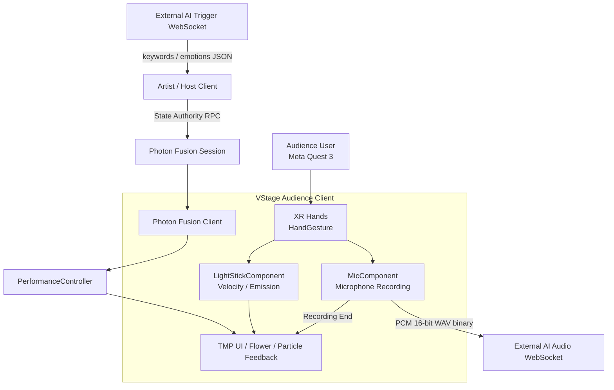
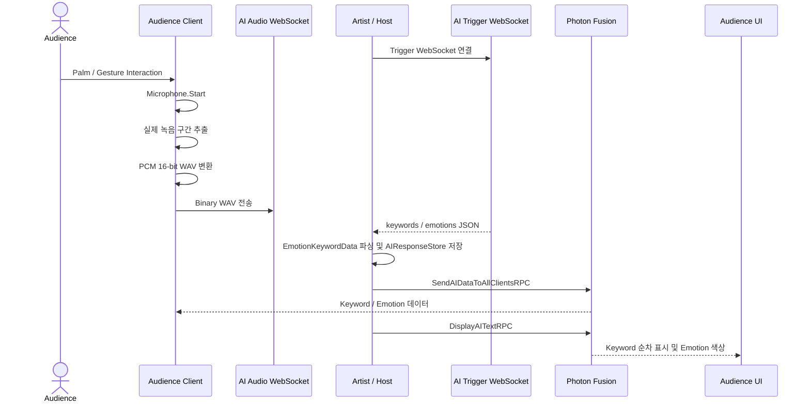
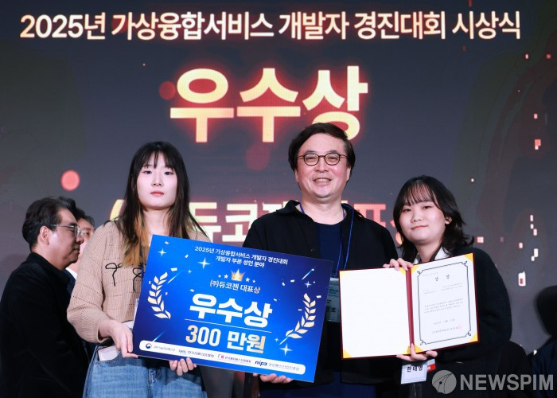
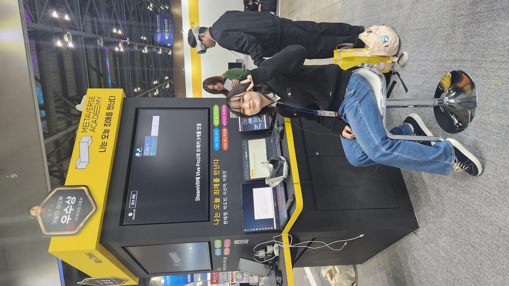

<div align="center">

<!-- Asset: docs/hero/hero-concert.png.png -->
<!-- 대표 이미지: 아티스트·무대·관객·응원봉/VFX가 함께 보이는 장면 -->


# VStage Audience

### 손짓과 목소리로 무대에 직접 참여하는 XR 버추얼 콘서트

**Unity · Meta Quest 3 기반 Audience XR Interaction Client**

🏆 **가상융합서비스개발자경진대회 우수상** · 오프라인 전시 시연 <sub>(연도·주최 확인 중 — 자세한 내용은 [Award · Exhibition](#award--exhibition))</sub>

<br>


<sub>실제 공연 장면 · 전체 데모 영상은 준비 중입니다</sub>

<br><br>


</div>

---

# Contents

1. [Project Overview](#project-overview)
2. [My Contribution](#my-contribution)
3. [Development Journey](#development-journey)
4. [Team Members & Roles](#team-members--roles)
5. [Technology Stack](#technology-stack)
6. [System Architecture](#system-architecture)
7. [AI Communication Sequence](#ai-communication-sequence)
8. [Technical Challenges](#technical-challenges)
9. [Core Code](#core-code)
10. [Project Structure](#project-structure)
11. [Development Environment](#development-environment)
12. [Known Limitations](#known-limitations)
13. [Award · Exhibition](#award--exhibition)
14. [Related Repository / Notice](#related-repository--notice)

---

# Project Overview

## Problem

온라인 공연에서 관객은 영상을 시청하거나 채팅을 입력하는 등 공연을 수동적으로 소비하는 경우가 많습니다. VStage는 관객의 손짓·움직임·음성을 XR Interaction으로 연결해 다음 질문에서 출발했습니다.

> **VR 콘서트의 관객이 실제 공연처럼 직접 참여하고 있다는 느낌을 줄 수 있을까?**

## Solution

VStage Audience는 Meta Quest 3의 Hand Tracking으로 마이크와 응원봉을 조작하고, 음성·움직임 데이터를 WebSocket과 Photon Fusion으로 공연 시스템에 연결합니다.

```text
XR Hand Tracking
      ↓
Gesture / Palm Interaction
      ↓
Microphone · Light Stick
      ↓
Voice · Movement Data
      ↓
WebSocket · Photon Fusion
      ↓
Audience UI · Recording Feedback VFX
```

| 항목 | 내용 |
| --- | --- |
| 프로젝트 | VStage - Virtual Concert Platform |
| 클라이언트 | Audience XR Client |
| 주요 플랫폼 | Meta Quest 3 / Android |
| 초기 R&D | Apple Vision Pro / visionOS |
| Engine | Unity 6 (6000.1.2f1) |
| Language | C# |
| Network | Photon Fusion |
| Communication | NativeWebSocket, Newtonsoft.Json |

---

# My Contribution

기존 팀의 XR·Photon·아바타 기반 위에, 관객이 실제 공연에 참여할 수 있는 아래 5가지 기능을 직접 설계·구현했습니다.

<table>
<tr>
<td width="280" valign="top">

<!-- TODO: docs/features/hand-interaction.gif -->
<div align="center"><sub>스크린샷/GIF 준비 중</sub></div>

</td>
<td valign="top">

### 01. XR Hands Gesture Interaction

컨트롤러 버튼 없이 손 모양만으로 마이크·응원봉을 사용할 수 있어야 했습니다.

* OpenXR / Unity XR Hands Tracking Event 연구 및 연결
* Hand Shape/Pose 조건 또는 관절 거리(10~35cm) 기반 판정
* Hold Time 0.2초, 검사 간격 0.1초로 순간적인 추적 오차에 의한 오검출 방지
* `GesturePerformed` / `GestureEnded` UnityEvent 분리로 마이크·응원봉 Component에 연결

`Assets/03_Scripts/HandGesture.cs` · `Assets/03_Scripts/Gestures/StaticHandGesture.cs`

</td>
</tr>
<tr>
<td width="280" valign="top">

<!-- TODO: docs/features/voice-recording.gif -->
<div align="center"><sub>스크린샷/GIF 준비 중</sub></div>

</td>
<td valign="top">

### 02. Voice Recording & WAV Pipeline

제스처 시작·종료 시점에 맞춰 실제 발화 구간만 잘라 AI 서버로 보내야 했습니다.

* `Microphone.Start` 기반 녹음, `Microphone.GetPosition`으로 실제 녹음 구간 추출
* PCM 16-bit WAV header 및 byte array 생성
* NativeWebSocket Binary message로 Audio WebSocket 전송
* `HandGesture` 경로는 `MicComponent`, `StaticHandGesture` 경로는 `RecordingManager`로 각각 연결되어 있으며 `App_Final`에서는 `HandGesture`/`MicComponent` 경로가 중심 흐름입니다

`Assets/03_Scripts/MicRecordFunction/MicComponent.cs` · `Assets/03_Scripts/RecordingManager.cs` · `Assets/03_Scripts/Api/WebSocketVoiceClient.cs`

</td>
</tr>
<tr>
<td width="280" valign="top">

<!-- TODO: docs/features/ai-relay.png -->
<div align="center"><sub>스크린샷/GIF 준비 중</sub></div>

</td>
<td valign="top">

### 03. Host-based AI Relay

여러 관객 Client가 각자 AI 서버에 요청하면 응답 시점과 결과가 사용자마다 달라지는 문제가 있었습니다. Host가 대표로 수신해 전체에 동일한 결과를 전파하는 구조로 정리했습니다.

* Host가 Trigger WebSocket의 `keywords` / `emotions` JSON 수신 및 파싱
* `AIResponseStore`에 저장 후 `SendAIDataToAllClientsRPC`로 모든 Client에 전달
* `DisplayAITextRPC`로 키워드 순차 표시 및 감정 색상 UI 갱신

`Assets/03_Scripts/Api/AIResponseStore.cs` · `Assets/03_Scripts/Photon/PerformanceSync/PerformanceController.cs` · `Assets/03_Scripts/Api/TMP_PRO.cs`

</td>
</tr>
<tr>
<td width="280" valign="top">

<!-- TODO: docs/features/lightstick-emission.gif -->
<div align="center"><sub>스크린샷/GIF 준비 중</sub></div>

</td>
<td valign="top">

### 04. Interactive Light Stick

응원봉을 흔드는 행동이 아무 시각적 반응도 없으면 관객이 참여감을 느끼기 어렵습니다.

* 손 위치를 Target으로 추적하고, 손을 놓으면 원래 Target으로 복귀
* `VelocityEstimator`가 여러 프레임의 이동·회전 속도를 평균화
* 속도를 0~1로 정규화해 `_EmissionColor` 강도로 변환

`Assets/03_Scripts/LightStickComponent.cs` · `Assets/03_Scripts/LightStickFunction/VelocityEstimator.cs` · `Assets/03_Scripts/LightStickFunction/EmissionController.cs`

</td>
</tr>
<tr>
<td width="280" valign="top">

<!-- TODO: docs/features/flower-vfx.gif -->
<div align="center"><sub>스크린샷/GIF 준비 중</sub></div>

</td>
<td valign="top">

### 05. Recording Feedback VFX

음성을 보내는 것만으로는 관객이 자기 행동의 결과를 즉시 인지하기 어렵습니다. 녹음 종료를 무대 위의 시각적 결과로 되돌려주는 연출을 붙였습니다.

* 녹음 종료 시 Energy Effect가 Flower Target으로 이동
* 도착 시 `MaterialPropertyBlock` 기반 Emission/Particle 효과 실행
* 다음 꽃으로 순차 점등 이어짐

이 VFX는 AI Emotion 결과가 아니라 **Recording End Interaction Feedback**입니다.

`Assets/03_Scripts/MicRecordFunction/RecordEndEffectComponent.cs` · `Assets/03_Scripts/MicRecordFunction/FlowerTarget.cs`

</td>
</tr>
</table>

> Photon Fusion 기본 Session, VRIK 전신 기반, 얼굴 트래킹 기반의 일부는 팀 공동 시스템입니다. 해당 기반 위에 위 5가지 기능을 확장·통합한 범위를 개인 기여로 설명합니다. Vision Pro → Meta Quest 3 플랫폼 전환 R&D 과정은 [Development Journey](#development-journey)에서 별도로 다룹니다.

---

# Development Journey

VStage는 하나의 저장소에서 한 번에 완성된 프로젝트가 아니라, Vision Pro feasibility R&D, Quest 3 전환, Audience 기능 통합을 거치며 발전했습니다. 아래 평가는 Git history의 개발 단계에 기반한 정리입니다.

| 단계 | 썸네일 | 단계별 변화 |
| --- | --- | --- |
| 1차 평가 |  | Vision Pro/PolySpatial 기반 XR·파티클·UI·마이크 prototype |
| 2차 평가 |  | Android/Quest 3 전환, XR Hands 제스처, 음성·응원봉 Interaction |
| 3차 평가 |  | AI Host Relay, 꽃 VFX, 키워드 UI, 공연 기능 통합 |

<sub>단계별 영상은 준비 중입니다.</sub>

## 1차 평가 — XR Concert Prototype (`VStage_vp`)

PolySpatial·visionOS XR Plugin·XR Hands 환경을 조사하고, Volume Camera·파티클·UI·마이크 prototype을 검증했습니다.

* `eeaef0b`: Apple visionOS XR Plugin 설치
* `021f21e`: PolySpatial 패키지 설치
* `cca61c7`: PolySpatial sample 빌드 테스트 성공 기록

Vision Pro prototype의 손 입력 스크립트는 실제 관절 좌표 처리보다 `Submit`, 마우스, Space 입력을 이용한 feasibility test에 가깝습니다.

## 2차 평가 — Quest 3 Platform Transition (`VStage_quest3`)

VisionOS/PolySpatial 구조를 제거하고 Android·Oculus·Meta OpenXR 기반으로 전환했습니다. 단순 플랫폼 이름 변경이 아니라 패키지·Loader·Build Settings·Input 구성을 함께 변경한 작업입니다.

* `c18a6a1`: Vision Pro 패키지 삭제
* `e40190e`: PolySpatial 파일 제거 및 Oculus Loader 전환
* `11ef239`: Android 플랫폼 전환
* `6a92551`: Meta OpenXR 및 Quest 설정
* `6065d32`, `9325f27`: Quest Hand Gesture 연결 및 정상화

## 3차 평가 — Integrated Audience Experience (`VStage_quest3_public`)

[My Contribution](#my-contribution)의 5가지 기능이 하나의 흐름으로 통합된 단계입니다. Audience 음성 → WAV → AI Trigger → Host Relay → 키워드 UI, 응원봉 Emission, Recording Feedback VFX가 이 시점에 함께 동작합니다.

## Vision Pro vs Meta Quest 3

<div align="center">


</div>

| Apple Vision Pro | Meta Quest 3 |
| --- | --- |
| PolySpatial / visionOS XR | Android / Meta OpenXR / Oculus |
| XR Hands feasibility prototype | Quest Hand Tracking Interaction |
| Volume Camera, UI, Particle, Microphone test | Audience 공연 기능 통합 |

Vision Pro prototype의 실제 손 관절 구현과 전체 공연 실기기 완성, 실기기 테스트 횟수는 이 저장소만으로 확인 범위 밖입니다. 안전하게는 "Vision Pro용 PolySpatial 환경을 조사하고 파티클·UI·마이크·Volume Camera prototype을 검증한 뒤, 실제 공연 Interaction 요구에 맞춰 Quest 3로 전환했다" 정도로 설명합니다.

---

# Team Members & Roles

VStage는 여러 저장소와 여러 작성자가 참여한 팀 프로젝트입니다. 아래 역할은 Git history와 팀에서 확인한 담당 영역을 기준으로 정리했습니다.

| 팀원 | 주요 파트 | 역할 |
| --- | --- | --- |
| 한태영 | 관객용 앱 개발 | Vision Pro·Meta Quest 3 XR R&D · OpenXR Hand Tracking 연구 및 관객 인터랙션 적용 · 음성·AI 응답 연동 · 응원봉·Recording Feedback |
| carlton368 / 이원진 | 아티스트용 앱 및 관객용 앱 그래픽 | 아티스트용 앱 개발 · 관객용 앱 렌더링 및 전체 그래픽 조정 |
| 이선아 | 아트·VFX | 무대 모델링 · VFX 제작 · 캐릭터 조정 |
| MinJuuu91923 | AI 서버 | AI 서버 개발 및 클라이언트 응답 연동 협의 |

<!-- TODO: docs/team/member-01.jpg 등 팀원 사진·이름·역할·GitHub 링크 추가 -->

---

# Technology Stack

## Engine / Language

| Technology | Version | 사용 목적 |
| --- | --- | --- |
| Unity | 6000.1.2f1 | XR Client 및 공연 Runtime |
| C# | - | Interaction, Network, Audio, Runtime Logic |

## XR

| Technology | Version | 사용 목적 |
| --- | --- | --- |
| Unity XR Hands | 1.5.1 | Hand Tracking 및 Joint Event |
| XR Interaction Toolkit | 3.1.2 | XR Interaction 기반 |
| Meta OpenXR | 2.2.0 | Meta Quest XR 기능 |
| Oculus XR Plugin | 4.5.1 | Quest Runtime |
| Unity OpenXR | 1.14.3 | XR Runtime |
| visionOS XR | 2.3.1 | Vision Pro R&D 저장소 |
| PolySpatial | historical | Vision Pro 초기 Prototype |

## Networking / Communication

| Technology | Version | 사용 목적 |
| --- | --- | --- |
| Photon Fusion | project asset/code | Session, Avatar, Performance Synchronization |
| NativeWebSocket | Git UPM | WAV 및 AI Trigger WebSocket |
| Newtonsoft.Json | 3.2.1 | Keyword / Emotion JSON Parsing |

## Graphics / Animation

| Technology | Version | 사용 목적 |
| --- | --- | --- |
| Universal Render Pipeline | 17.1.0 | XR Rendering |
| Shader Graph | Unity | Emission 및 Interactive Visual Feedback |
| Visual Effect Graph | 17.1.0 | Particle/VFX |
| Timeline | 1.8.7 | 공연 Sequence |
| Cinemachine | 3.1.4 | 공연 Camera |
| FinalIK / VRIK | External Asset | Network Avatar Pose |

PolySpatial과 visionOS XR은 현재 Quest Audience main의 런타임 패키지가 아니라 `VStage_vp`의 R&D 및 Git history에 근거한 항목입니다.

---

# System Architecture



AI 서버 내부의 STT·감정 분석·키워드 생성 알고리즘은 이 저장소에 포함되어 있지 않습니다. 기본 Build Settings에서 활성화된 Audience 씬은 `Assets/01_Scenes/App_Final.unity`입니다.

---

# AI Communication Sequence



공연 코드의 현재 기준 시간은 AI Trigger 요청 33초, AI 텍스트 표시 34초입니다. `VStage_Audience_Snapshot`의 `repectoring` 브랜치에서는 이 값을 `PerformanceTimingConfig`로 분리했지만, 현재 main 코드에는 기존 Inspector/코드 값이 남아 있습니다.

AI Response와 Recording Feedback VFX는 별개입니다.

```text
AI Response → Keyword / Emotion → Audience UI
Recording End → Energy Effect → Flower / Particle Feedback
```

---

# Technical Challenges

| 문제 | 해결 방식 |
| --- | --- |
| Hand Tracking의 순간적인 오차로 Interaction이 반복 실행됨 | 검사 간격, 최소 Hold Time, 시작·종료 상태, 중복 실행 방지 플래그를 함께 사용 |
| Client마다 AI 응답 시점·결과가 달라짐 | Host가 AI 응답을 대표 수신하고 Photon RPC로 전체 Client에 Relay (`AI Trigger Response → Host / State Authority → Photon RPC → Audience Clients`) |
| Network 환경에서 전신 IK 계산 충돌 | Host에서만 VRIK 포즈를 계산하고, Client는 수신한 Root/Bone 회전값을 직접 적용 (구현 방식은 확인되나 성능 향상 수치는 별도 측정 자료 없음) |
| 음성 전송만으로는 행동의 결과를 즉시 인지하기 어려움 | 녹음 종료 이벤트를 Energy Effect → Flower Emission/Particle sequence로 연결해 입력과 시각적 결과의 인과관계를 표현 |
| VisionOS/PolySpatial → Android/Oculus/Meta OpenXR 플랫폼 차이 | Package, Loader, Build Target, Input 설정을 함께 전환 |

---

# Core Code

| 기능 | 코드 | 역할 |
| --- | --- | --- |
| Hand Gesture | `Assets/03_Scripts/HandGesture.cs` | Hand Shape/Pose 기반 제스처 이벤트 |
| Recording Trigger | `Assets/03_Scripts/RecordingManager.cs` | `StaticHandGesture`의 Performed/Ended 이벤트를 녹음 시작/종료로 연결 |
| Static Gesture | `Assets/03_Scripts/Gestures/StaticHandGesture.cs` | 거리 기반 별도 제스처 구현 |
| Voice Recording | `Assets/03_Scripts/MicRecordFunction/MicComponent.cs` | 녹음, 구간 추출, WAV 변환 |
| AI WebSocket | `Assets/03_Scripts/Api/WebSocketVoiceClient.cs` | Audio/Trigger WebSocket |
| Light Stick | `Assets/03_Scripts/LightStickComponent.cs` | 손 Target 부착·복귀 |
| Velocity | `Assets/03_Scripts/LightStickFunction/VelocityEstimator.cs` | 속도 샘플 평균화 |
| Emission | `Assets/03_Scripts/LightStickFunction/EmissionController.cs` | 속도 → Material Emission |
| Recording VFX | `Assets/03_Scripts/MicRecordFunction/RecordEndEffectComponent.cs` | Energy Effect 이동 및 순서 제어 |
| Flower | `Assets/03_Scripts/MicRecordFunction/FlowerTarget.cs` | 꽃 Emission 활성화 |
| AI Performance | `Assets/03_Scripts/Photon/PerformanceSync/PerformanceController.cs` | AI RPC 및 공연 타이밍 |
| Network Avatar | `Assets/03_Scripts/Photon/VRIKNetworkPlayer.cs` | Root/Bone/Facial 동기화 |
| AI Store | `Assets/03_Scripts/Api/AIResponseStore.cs` | Keyword/Emotion 저장 |
| Text UI | `Assets/03_Scripts/Api/TMP_PRO.cs` | 키워드 순차 표시 및 감정 색상 |

---

# Project Structure

```text
Assets/
├── 01_Scenes/                 # App_Final, Network, VFX, Test Scenes
├── 02_Prefabs/                # XR, Network, Interaction Prefabs
├── 03_Scripts/
│   ├── Api/                   # AI Store, WebSocket, Text UI
│   ├── AudienceReactDisplay/  # Emotion Color Mapping
│   ├── Calibration/           # VR Body Calibration
│   ├── Facial/                # Facial RPC/Application
│   ├── Gestures/              # Distance-based Gesture (legacy path)
│   ├── LightStickFunction/    # Velocity / Emission
│   ├── MicRecordFunction/     # Recording / Flower VFX
│   ├── Photon/                # Fusion Session / Avatar / Performance
│   ├── Timeline/              # Timeline-related scripts
│   ├── UI/                    # XR UI and interaction UI
│   └── (root)                 # HandGesture, RecordingManager, LightStickComponent 등 아직 하위 폴더로 정리되지 않은 스크립트
├── 04_Input Actions/          # Input assets
├── Art/                       # Stage, environment, character and VFX assets
├── Photon/                    # Fusion project assets
├── Settings/                  # URP and rendering assets
├── Timeline/                  # Timeline assets
├── XR/                        # XR settings and loaders
└── Resources/                 # Runtime resources

docs/
├── hero/
├── achievements/
├── evolution/
├── team/
├── rnd/
└── features/
```

---

# Development Environment

이 저장소는 포트폴리오 공개용 Unity 프로젝트입니다. 전체 공연 실행에는 다음 외부 요소가 필요할 수 있습니다.

* Unity 6000.1.2f1
* Meta Quest 3 및 Android Build Environment
* Photon Fusion App ID 및 Network 설정
* Artist / Host Client
* 외부 AI Audio / Trigger WebSocket Server

서버 주소, App ID, 인증 정보는 공개 저장소에 운영값으로 포함하지 않는 것이 안전합니다.

> **Asset License Notice**: 이 저장소에는 캐릭터·무대 텍스처 등 `Assets/Art`, `Assets/Photon`, `MagicaCloth2` 하위의 일부 유료/서드파티 에셋이 포트폴리오 시연 목적으로 함께 커밋되어 있습니다. 해당 에셋을 재배포·재사용할 계획이라면 원 배포처의 라이선스 조건을 먼저 확인해야 합니다.

`VStage_Audience_Snapshot`의 `repectoring` 브랜치에서는 `AIServerConfig`, `PerformanceTimingConfig`, `NetworkConfig` ScriptableObject를 도입했지만, 현재 main과 동일한 상태로 간주하면 안 됩니다.

## Getting Started

1. Unity Hub에서 **Unity 6000.1.2f1** 설치
2. 저장소는 `.gitattributes`에 정의된 Git LFS(png, fbx, wav, mp4 등)를 사용하므로, clone 전 `git lfs install` 실행
3. Unity Hub → `Open Project`로 루트 폴더를 열면 `Packages/manifest.json` 기준으로 패키지가 자동 설치됨
4. `Assets/Photon/Fusion/Resources/PhotonAppSettings.asset`에 본인 Photon Fusion App ID를 입력 (저장소에 포함된 값은 본인 환경에 맞게 교체 필요)
5. `Assets/03_Scripts/Api/WebSocketVoiceClient.cs`의 `audioWebSocketUrl` / `triggerWebSocketUrl`을 본인 AI 서버 주소로 교체
6. Build Settings에서 `Assets/01_Scenes/App_Final.unity`가 활성 씬인지 확인
7. `File > Build Profiles`에서 Android(Meta Quest 3)로 Platform 전환 후, Quest Link/Air Link 또는 USB로 기기를 연결해 Build & Run
8. VStage Artist/Host Client와 동일한 Photon Room Name으로 접속

AI Audio/Trigger WebSocket 서버와 Artist Host Client 없이는 XR Hand Interaction과 네트워크 아바타 동기화만 로컬에서 확인할 수 있습니다.

---

# Known Limitations

포트폴리오 공개 저장소로 정리하는 과정에서 확인된, 아직 해결되지 않은 부분을 그대로 남겨둡니다.

| 항목 | 현재 상태 |
| --- | --- |
| Fusion Callback 빈 구현 | `OnInput` 등 일부 Photon Fusion callback이 빈 구현으로 남아 있음 |
| `OnConnectRequest` 처리 | 연결 요청을 광범위하게 허용하는 상태로, Room 접근 제어가 느슨함 |
| 서버 주소 하드코딩 | AI WebSocket 주소가 `WebSocketVoiceClient.cs`에 직접 값으로 들어 있어 환경별 분리가 안 됨 (Audience 최신 스냅샷에서는 `AIServerConfig` ScriptableObject로 분리를 시도했으나 main에는 아직 병합되지 않음) |
| `EventBus` 활용도 | 구조는 정의되어 있으나 실제 핵심 기능 다수는 여전히 직접 참조·RPC로 연결됨 |
| `FindObjectOfType` / `GameObject.Find` 의존 | 일부 스크립트가 이름 기반 탐색에 의존하고 있어 씬 구성 변경에 취약함 |
| 테스트 씬과 Build 씬 분리 | `Assets/01_Scenes`에 기능 검증용 테스트 씬(`RecordEffect`, `EnergyballToFlowerShine` 등)과 실제 Build 씬이 함께 존재함 |
| 제스처 → 녹음 경로 이원화 | `HandGesture`→`MicComponent`, `StaticHandGesture`→`RecordingManager` 두 경로가 공존하며, 정리 및 단일화가 필요함 |

---

# Award · Exhibition

<table>
<tr>
<td width="50%" align="center">



**가상융합서비스개발자경진대회 우수상**
<br><sub>연도·주최/주관 확인 중</sub>

</td>
<td width="50%" align="center">



**오프라인 전시 부스 운영**
<br><sub>관람객 대상 XR 콘서트 시스템 시연 · 행사명·기간 확인 중</sub>

</td>
</tr>
</table>

세부 정보(수상일, 관련 기사, 전시 장소 등)는 준비 중입니다.

---

# Related Repository / Notice

## VStage Artist

공연자·Host 측 Client입니다.

[VStage Artist Repository](https://github.com/Virtual-Idol-Concert-Platform/VStage_Artist)

## Portfolio Notice

VStage는 팀 프로젝트입니다. 이 README는 프로젝트 전체 구조를 설명하되, [My Contribution](#my-contribution)에 정리한 5가지 기능과 Vision Pro → Meta Quest 3 플랫폼 전환 R&D를 개인 기여 중심으로 다룹니다.

Photon Fusion Session, VRIK 전신 기반, Artist 측 얼굴 추적 및 렌더링 기반은 팀 공동 시스템으로 구분합니다. 외부 AI 서버 자체를 개발했다고 주장하지 않으며, AI Emotion이 Stage Lighting을 직접 제어한다고 표현하지 않습니다.

<!-- TODO: docs/features, docs/team 실제 이미지 채우기 / 평가별 영상·수상 연도·전시 정보 확정되는 대로 업데이트 -->
