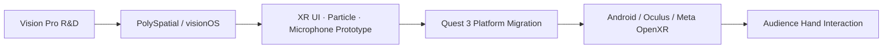
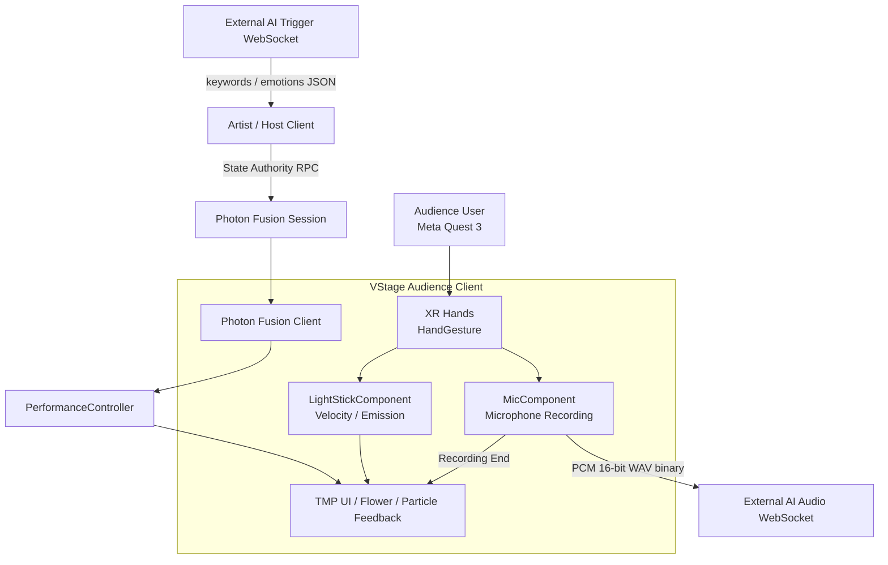
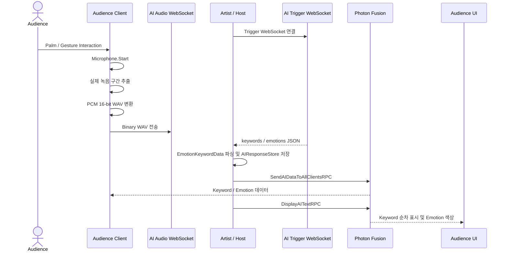
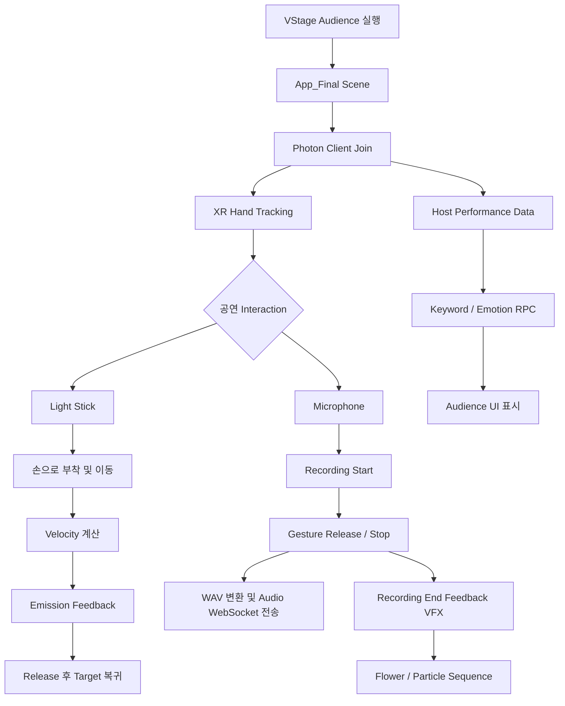

<div align="center">

<!-- Asset: docs/hero/hero-concert.png.png -->
<!-- 대표 이미지: 아티스트·무대·관객·응원봉/VFX가 함께 보이는 장면 -->


# VStage Audience

### 손짓과 목소리로 무대에 직접 참여하는 XR 버추얼 콘서트

**Unity · Meta Quest 3 기반 Audience XR Interaction Client**

<br>

<!-- TODO: replace FULL_DEMO_VIDEO_URL with the YouTube URL -->
<div align="center">
<a href="FULL_DEMO_VIDEO_URL">
  
</a>
<a href="FULL_DEMO_VIDEO_URL">
  
</a>
</div>

### ▶ Full Demo Video


</div>

---

# Award · Exhibition

VStage는 팀 개발 과정에서 XR 공연 기능을 구현하고, 경진대회와 오프라인 전시를 통해 사용자에게 시연한 프로젝트입니다.

## 가상융합서비스개발자경진대회 우수상

<!-- Asset: docs/achievements/award.jpg -->
<!-- TODO: 정확한 연도·주최/주관·부문·수상일·관련 기사 확인 -->

<div align="center">

</div>

> **가상융합서비스개발자경진대회 우수상**
>
> TODO: 어떤 기술적 가치와 사용자 경험을 평가받았는지 1~2문장 추가

| 항목 | 내용 |
| --- | --- |
| 대회 | 가상융합서비스개발자경진대회 |
| 수상 | 우수상 |
| 연도 | TODO |
| 주최 / 주관 | TODO |
| 출품 프로젝트 | VStage |
| 관련 링크 | [수상 관련 기사 / 공식 페이지](NEWS_OR_AWARD_URL) |

## Exhibition

<!-- Asset: docs/achievements/exhibition-booth.jpg -->
<div align="center">

</div>

VStage의 XR 콘서트 시스템을 직접 체험할 수 있도록 오프라인 전시 부스를 운영하고 관람객 대상 시연을 진행했습니다.

<!-- TODO: 전시 행사명·장소·운영 기간·체험 방식·담당 역할 -->

* [전시 관련 뉴스](EXHIBITION_NEWS_URL)
* [행사 공식 페이지](EVENT_URL)

---

# Development Journey

VStage는 하나의 저장소에서 한 번에 완성된 프로젝트가 아니라, Vision Pro feasibility R&D, Quest 3 전환, Audience 기능 통합을 거치며 발전했습니다. 아래 평가는 Git history의 개발 단계에 기반한 정리입니다. 각 평가 썸네일을 클릭하면 해당 YouTube 영상으로 이동합니다.

| 단계 | 영상 자리 | 단계별 변화 |
| --- | --- | --- |
| 1차 평가 | [](YOUTUBE_EVALUATION_1_URL) | Vision Pro/PolySpatial 기반 XR·파티클·UI·마이크 prototype |
| 2차 평가 | [](YOUTUBE_EVALUATION_2_URL) | Android/Quest 3 전환, XR Hands 제스처, 음성·응원봉 Interaction |
| 3차 평가 | [](YOUTUBE_EVALUATION_3_URL) | AI Host Relay, 꽃 VFX, 키워드 UI, 공연 기능 통합 |

## 1차 평가 — XR Concert Prototype

`VStage_vp`에서 PolySpatial·visionOS XR Plugin·XR Hands 환경을 조사하고, Volume Camera·파티클·UI·마이크 prototype을 검증했습니다.

* `eeaef0b`: Apple visionOS XR Plugin 설치
* `021f21e`: PolySpatial 패키지 설치
* `cca61c7`: PolySpatial sample 빌드 테스트 성공 기록

Vision Pro prototype의 손 입력 스크립트는 실제 관절 좌표 처리보다 `Submit`, 마우스, Space 입력을 이용한 feasibility test에 가깝습니다.

## 2차 평가 — Quest 3 Platform Transition & Interaction

`VStage_quest3`에서 VisionOS/PolySpatial 구조를 제거하고 Android·Oculus·Meta OpenXR 기반으로 전환했습니다.

* `c18a6a1`: Vision Pro 패키지 삭제
* `e40190e`: PolySpatial 파일 제거 및 Oculus Loader 전환
* `11ef239`: Android 플랫폼 전환
* `6a92551`: Meta OpenXR 및 Quest 설정
* `6065d32`, `9325f27`: Quest Hand Gesture 연결 및 정상화

이 단계에서 컨트롤러 중심 prototype을 Quest 3 관객용 손 추적, 마이크, 응원봉 Interaction으로 구체화했습니다.

## 3차 평가 — Integrated Audience Experience

`VStage_quest3_public`과 현재 Audience main에서는 기능을 통합했습니다.

* Audience 음성을 PCM 16-bit WAV로 변환해 Audio WebSocket으로 전송
* Host가 Trigger WebSocket의 keyword/emotion JSON을 수신
* Photon RPC로 AI 데이터를 Client에 전달
* 응원봉 속도에 따른 Emission Feedback
* 녹음 종료와 꽃·파티클 VFX 연결
* 키워드 순차 표시 및 감정 색상 UI

<!-- TODO: 3차 평가에서 실제로 시연한 기능과 영상 링크 확인 -->

---

# Contents

1. [Project Overview](#project-overview)
2. [Team Members & Roles](#team-members--roles)
3. [My Contribution](#my-contribution)
4. [XR Platform R&D](#xr-platform-rd)
5. [Technology Stack](#technology-stack)
6. [System Architecture](#system-architecture)
7. [AI Communication Sequence](#ai-communication-sequence)
8. [Audience User Scenario](#audience-user-scenario)
9. [Audience Experience](#audience-experience)
10. [Key Features](#key-features)
11. [Technical Challenges](#technical-challenges)
12. [Core Code](#core-code)
13. [Project Structure](#project-structure)
14. [Development Environment](#development-environment)
15. [Related Repository / Notice](#related-repository--notice)

---

# Project Overview

## Problem

온라인 공연에서 관객은 영상을 시청하거나 채팅을 입력하는 등 공연을 수동적으로 소비하는 경우가 많습니다. VStage는 관객의 손짓·움직임·음성을 XR Interaction으로 연결해 다음 질문에서 출발했습니다.

> **VR 콘서트의 관객이 실제 공연처럼 직접 참여하고 있다는 느낌을 줄 수 있을까?**

## Solution

VStage Audience는 Meta Quest 3의 Hand Tracking으로 마이크와 응원봉을 조작하고, 음성·움직임 데이터를 WebSocket과 Photon Fusion으로 공연 시스템에 연결합니다.

```text
XR Hand Tracking
      ↓
Gesture / Palm Interaction
      ↓
Microphone · Light Stick
      ↓
Voice · Movement Data
      ↓
WebSocket · Photon Fusion
      ↓
Audience UI · Recording Feedback VFX
```

| 항목 | 내용 |
| --- | --- |
| 프로젝트 | VStage - Virtual Concert Platform |
| 클라이언트 | Audience XR Client |
| 주요 플랫폼 | Meta Quest 3 / Android |
| 초기 R&D | Apple Vision Pro / visionOS |
| Engine | Unity 6 (6000.1.2f1) |
| Language | C# |
| Network | Photon Fusion |
| Communication | NativeWebSocket, Newtonsoft.Json |

---

# Team Members & Roles

VStage는 여러 저장소와 여러 작성자가 참여한 팀 프로젝트입니다. 아래 역할은 Git history와 팀에서 확인한 담당 영역을 기준으로 정리했습니다.

| 팀원 | 주요 파트 | 역할 |
| --- | --- | --- |
| 한태영 | 관객용 앱 개발 | Vision Pro·Meta Quest 3 XR R&D · OpenXR Hand Tracking 연구 및 관객 인터랙션 적용 · 음성·AI 응답 연동 · 응원봉·Recording Feedback |
| carlton368 / 이원진 | 아티스트용 앱 및 관객용 앱 그래픽 | 아티스트용 앱 개발 · 관객용 앱 렌더링 및 전체 그래픽 조정 |
| 이선아 | 아트·VFX | 무대 모델링 · VFX 제작 · 캐릭터 조정 |
| MinJuuu91923 | AI 서버 | AI 서버 개발 및 클라이언트 응답 연동 협의 |

<!-- TODO: docs/team/member-01.jpg 등 팀원 사진·이름·역할·GitHub 링크 추가 -->

---

# My Contribution

기존 팀의 XR·Photon·아바타 기반 위에 Audience가 실제 공연에 참여할 수 있는 기능을 확장·통합했습니다.

## 01. Vision Pro · Meta Quest 3 XR R&D

Vision Pro와 Meta Quest 3를 대상으로 XR Runtime과 Hand Tracking 환경을 비교·연구하고, 관객용 앱에 적용하는 과정을 진행했습니다. Git history에서는 Vision Pro R&D에서 Quest 3 환경으로 확장되는 과정이 확인됩니다.

* VisionOS/PolySpatial 패키지 제거
* Android Build Target 전환
* Oculus Loader 적용
* Meta OpenXR 구성
* Quest 3용 XR Hands Interaction 연결

이는 단순 플랫폼 이름 변경이 아니라 패키지·Loader·Build Settings·Input 구성을 함께 변경한 작업입니다. 다만 Vision Pro에서 전체 공연을 완성했다거나 실기기 테스트 범위까지는 이 저장소만으로 주장하지 않습니다.

## 02. OpenXR Hand Tracking 연구 및 Audience Interaction 적용

* OpenXR / Unity XR Hands Tracking Event 연구 및 연결
* Hand Shape/Pose 또는 관절 거리 기반 판정
* Gesture Hold Time과 상태 전이 처리
* 마이크·응원봉 Component 연결

현재 `App_Final`에서 직접 연결되는 중심 스크립트는 `HandGesture.cs`이며, `StaticHandGesture.cs`는 별도의 거리 기반 구현·이전 연구 경로입니다.

## 03. Microphone / WAV Processing

* `Microphone.Start` 기반 녹음
* `Microphone.GetPosition`을 이용한 실제 녹음 구간 추출
* PCM 16-bit WAV header 및 byte array 생성
* NativeWebSocket Binary message 전송

## 04. AI WebSocket Integration

AI 서버 개발 담당자와 응답 데이터의 수신 방식과 Unity 내 표현 방식을 협의하며 연동했습니다. Audience Client는 Audio WebSocket으로 WAV를 보내고, Host 경로에서는 Trigger WebSocket의 JSON 응답을 처리합니다. 외부 AI 서버 자체는 이 저장소의 구현 범위가 아닙니다.

## 05. Host-based AI Relay

* `keywords` / `emotions` JSON 파싱
* Host의 `AIResponseStore` 저장
* `SendAIDataToAllClientsRPC`를 통한 Client 전달
* `DisplayAITextRPC`를 통한 키워드 UI 표시

## 06. Light Stick Interaction

* 손 위치 Target 추적
* 손을 놓을 때 원래 Target으로 복귀
* `VelocityEstimator`의 속도 평균화
* 속도 → `_EmissionColor` 강도 변환

## 07. Recording Feedback VFX

녹음이 끝났을 때 Energy Effect가 Flower Target으로 이동하고 꽃 Emission/Particle 효과가 실행됩니다. 이 VFX는 AI Emotion 결과가 아니라 **Recording End Interaction Feedback**입니다.

> Photon Fusion 기본 Session, VRIK 전신 기반, 얼굴 트래킹 기반의 일부는 팀 공동 시스템입니다. 해당 기반 위에 Audience 기능을 확장·통합한 범위를 개인 기여로 설명합니다.

---

# XR Platform R&D

<!-- TODO: replace VISION_PRO_RND_VIDEO_URL and QUEST3_RND_VIDEO_URL with YouTube URLs -->
<div align="center">
<a href="VISION_PRO_RND_VIDEO_URL">
  
</a>
<a href="VISION_PRO_RND_VIDEO_URL">
  
</a>
<a href="VISION_PRO_RND_VIDEO_URL">
  
</a>
<a href="QUEST3_RND_VIDEO_URL">
  
</a>
</div>

| Apple Vision Pro | Meta Quest 3 |
| --- | --- |
| PolySpatial / visionOS XR | Android / Meta OpenXR / Oculus |
| XR Hands feasibility prototype | Quest Hand Tracking Interaction |
| Volume Camera, UI, Particle, Microphone test | Audience 공연 기능 통합 |



`VStage_vp`에서 PolySpatial과 visionOS 환경을 조사한 뒤 `VStage_quest3`에서 실제로 Android·Oculus·Meta OpenXR 구조로 전환했습니다. Vision Pro prototype의 실제 손 관절 구현과 전체 공연 실기기 완성은 확인 범위 밖입니다.

---

# Technology Stack

## Engine / Language

| Technology | Version | 사용 목적 |
| --- | --- | --- |
| Unity | 6000.1.2f1 | XR Client 및 공연 Runtime |
| C# | - | Interaction, Network, Audio, Runtime Logic |

## XR

| Technology | Version | 사용 목적 |
| --- | --- | --- |
| Unity XR Hands | 1.5.1 | Hand Tracking 및 Joint Event |
| XR Interaction Toolkit | 3.1.2 | XR Interaction 기반 |
| Meta OpenXR | 2.2.0 | Meta Quest XR 기능 |
| Oculus XR Plugin | 4.5.1 | Quest Runtime |
| Unity OpenXR | 1.14.3 | XR Runtime |
| visionOS XR | 2.3.1 | Vision Pro R&D 저장소 |
| PolySpatial | historical | Vision Pro 초기 Prototype |

## Networking / Communication

| Technology | Version | 사용 목적 |
| --- | --- | --- |
| Photon Fusion | project asset/code | Session, Avatar, Performance Synchronization |
| NativeWebSocket | Git UPM | WAV 및 AI Trigger WebSocket |
| Newtonsoft.Json | 3.2.1 | Keyword / Emotion JSON Parsing |

## Graphics / Animation

| Technology | Version | 사용 목적 |
| --- | --- | --- |
| Universal Render Pipeline | 17.1.0 | XR Rendering |
| Shader Graph | Unity | Emission 및 Interactive Visual Feedback |
| Visual Effect Graph | 17.1.0 | Particle/VFX |
| Timeline | 1.8.7 | 공연 Sequence |
| Cinemachine | 3.1.4 | 공연 Camera |
| FinalIK / VRIK | External Asset | Network Avatar Pose |

PolySpatial과 visionOS XR은 현재 Quest Audience main의 런타임 패키지가 아니라 `VStage_vp`의 R&D 및 Git history에 근거한 항목입니다.

---

# System Architecture



AI 서버 내부의 STT·감정 분석·키워드 생성 알고리즘은 이 저장소에 포함되어 있지 않습니다.

---

# AI Communication Sequence Diagram



공연 코드의 현재 기준 시간은 AI Trigger 요청 33초, AI 텍스트 표시 34초입니다. `VStage_Audience_Snapshot`의 `repectoring` 브랜치에서는 이 값을 `PerformanceTimingConfig`로 분리했지만, 현재 main 코드에는 기존 Inspector/코드 값이 남아 있습니다.

AI Response와 Recording Feedback VFX는 별개입니다.

```text
AI Response → Keyword / Emotion → Audience UI
Recording End → Energy Effect → Flower / Particle Feedback
```

---

# Audience User Scenario



기본 Build Settings에서 활성화된 Audience 씬은 `App_Final.unity`입니다. Waiting Room 및 테스트 씬은 프로젝트에 존재하지만 기본 실행 흐름으로 단정하지 않습니다.

---

# Audience Experience

## 01. Concert Experience

<!-- TODO: docs/experience/concert.png -->


가상 공연 공간에서 Host가 진행하는 공연과 다른 참가자의 상태를 함께 경험합니다.

## 02. Hand Tracking

<!-- TODO: docs/experience/hand-tracking.gif -->


컨트롤러 입력에만 의존하지 않고 XR Hands로 마이크와 응원봉 Interaction을 시작합니다.

## 03. Light Stick Interaction

<!-- TODO: docs/experience/lightstick.gif -->


응원봉 이동 속도를 시각적 Emission Feedback으로 연결합니다.

## 04. Microphone Interaction

<!-- TODO: docs/experience/microphone.gif -->


손동작으로 마이크를 잡고 녹음한 뒤 외부 AI Audio WebSocket으로 음성을 전달합니다.

## 05. Recording Feedback VFX

<!-- TODO: docs/experience/flower-vfx.gif -->


녹음 종료 후 Energy Effect가 Flower Target으로 이동하고 꽃 Emission 및 Particle 효과가 실행됩니다.

## 06. AI Keyword / Emotion

<!-- TODO: docs/experience/ai-feedback.png -->


Host가 전달한 Keyword/Emotion 데이터를 Audience UI에 표시합니다. AI Emotion이 Stage Lighting을 직접 제어한다고 설명하지 않습니다.

## 07. Network Avatar

<!-- TODO: docs/experience/network-avatar.gif -->


Photon Fusion 기반 Network Data를 통해 공연 참가자에게 동일한 공연 상태를 전달합니다. Photon/VRIK 전체 기반은 팀 공동 시스템입니다.

---

# Key Features

## 01. XR Hands Interaction

`HandGesture.cs`는 XR Hands의 Hand Shape/Pose 조건과 유지 시간을 이용해 제스처 상태를 판단하고 UnityEvent를 발생시킵니다. `StaticHandGesture.cs`에는 Middle Metacarpal과 Target Transform 사이의 10~35cm 거리 기반 별도 구현이 있습니다.

* XR Hand Tracking Event
* Hold Time: 0.2초
* 검사 간격: 0.1초
* Gesture Performed / Ended 분리
* Microphone / Light Stick 연결

<!-- TODO: docs/features/hand-interaction.gif -->

## 02. Voice Recording & WAV Pipeline

```text
Palm / Gesture Interaction
        ↓
Microphone.Start (16 kHz)
        ↓
Microphone.GetPosition
        ↓
Actual Segment Extraction
        ↓
PCM 16-bit WAV
        ↓
Binary WebSocket
```

`MicComponent`가 녹음 종료 시 실제 구간을 추출하고 `WebSocketVoiceClient.TrySendWav()`에 byte array를 전달합니다.

## 03. Interactive Light Stick

```text
Hand Movement
      ↓
VelocityEstimator
      ↓
Speed Normalization
      ↓
EmissionController
      ↓
Renderer.material _EmissionColor
```

`VelocityEstimator`는 여러 프레임의 이동·회전 속도를 평균화하고, `EmissionController`가 속도를 Emission 강도로 변환합니다.

<!-- TODO: docs/features/lightstick-emission.gif -->

## 04. AI Host Relay

```text
Audience Client ── WAV Binary ──> AI Audio WebSocket

AI Trigger WebSocket ── JSON ──> Artist / Host
Artist / Host ── Photon RPC ──> Audience Clients
```

Host는 `keywords`와 `emotions`를 파싱하고 `PerformanceController`를 통해 Client에 전달합니다. 외부 AI 서버의 내부 구현은 포함하지 않습니다.

## 05. Recording Feedback VFX

```text
Recording End
      ↓
Energy Effect
      ↓
Flower Target
      ↓
MaterialPropertyBlock / Emission
      ↓
Next Flower Sequence
```

이 기능은 AI 결과가 아니라 녹음 종료를 관객에게 피드백하는 Interaction 연출입니다.

<!-- TODO: docs/features/flower-vfx.gif -->

---

# Technical Challenges

## 01. Hand Tracking의 순간적인 오차

손 관절을 매 프레임 단순 비교하면 추적 오차로 Interaction이 반복 실행될 수 있습니다. 검사 간격, 최소 Hold Time, 시작·종료 상태, 중복 실행 방지 플래그를 함께 사용했습니다.

## 02. Client마다 다른 AI Event State

각 Client가 AI 응답을 독립적으로 처리하면 응답 시점과 결과가 달라질 수 있습니다. Git history에서 Host 중심 응답 수신과 Photon RPC Relay 방향으로 변경한 흐름이 확인됩니다.

```text
AI Trigger Response → Host / State Authority → Photon RPC → Audience Clients
```

## 03. Network Avatar Calculation

Client마다 VRIK를 실행하는 대신 Host에서 포즈를 계산하고 Client에서 수신한 Root/Bone 회전을 직접 적용하는 구조를 사용합니다. 구현 방식은 확인되지만 구체적인 성능 향상 수치는 측정 자료가 없으므로 기재하지 않습니다.

## 04. 관객 입력에 대한 Feedback

음성 전송만으로는 관객이 행동의 결과를 즉시 인지하기 어렵습니다. 녹음 종료 이벤트를 Energy Effect와 Flower Emission/Particle sequence로 연결해 입력과 시각적 결과의 인과관계를 표현했습니다.

## 05. 플랫폼별 XR Runtime 차이

VisionOS/PolySpatial에서 Android/Oculus/Meta OpenXR로 전환하면서 Package, Loader, Build Target, Input 설정을 함께 변경했습니다.

---

# Core Code

| 기능 | 코드 | 역할 |
| --- | --- | --- |
| Hand Gesture | `Assets/03_Scripts/Gestures/HandGesture.cs` | Hand Shape/Pose 기반 제스처 이벤트 |
| Static Gesture | `Assets/03_Scripts/Gestures/StaticHandGesture.cs` | 거리 기반 별도 제스처 구현 |
| Voice Recording | `Assets/03_Scripts/MicRecordFunction/MicComponent.cs` | 녹음, 구간 추출, WAV 변환 |
| AI WebSocket | `Assets/03_Scripts/Api/WebSocketVoiceClient.cs` | Audio/Trigger WebSocket |
| Light Stick | `Assets/03_Scripts/LightStickComponent.cs` | 손 Target 부착·복귀 |
| Velocity | `Assets/03_Scripts/LightStickFunction/VelocityEstimator.cs` | 속도 샘플 평균화 |
| Emission | `Assets/03_Scripts/LightStickFunction/EmissionController.cs` | 속도 → Material Emission |
| Recording VFX | `Assets/03_Scripts/MicRecordFunction/RecordEndEffectComponent.cs` | Energy Effect 이동 및 순서 제어 |
| Flower | `Assets/03_Scripts/MicRecordFunction/FlowerTarget.cs` | 꽃 Emission 활성화 |
| AI Performance | `Assets/03_Scripts/Photon/PerformanceSync/PerformanceController.cs` | AI RPC 및 공연 타이밍 |
| Network Avatar | `Assets/03_Scripts/Photon/VRIKNetworkPlayer.cs` | Root/Bone/Facial 동기화 |
| AI Store | `Assets/03_Scripts/Api/AIResponseStore.cs` | Keyword/Emotion 저장 |
| Text UI | `Assets/03_Scripts/Api/TMP_PRO.cs` | 키워드 순차 표시 및 감정 색상 |

---

# Project Structure

```text
Assets/
├── 01_Scenes/                 # App_Final, Network, VFX, Test Scenes
├── 02_Prefabs/                # XR, Network, Interaction Prefabs
├── 03_Scripts/
│   ├── Api/                   # AI Store, WebSocket, Text UI
│   ├── AudienceReactDisplay/  # Emotion Color Mapping
│   ├── Facial/                # Facial RPC/Application
│   ├── Gestures/              # XR Hand Gesture
│   ├── LightStickFunction/    # Velocity / Emission
│   ├── MicRecordFunction/     # Recording / Flower VFX
│   ├── Photon/                # Fusion Session / Avatar / Performance
│   ├── Timeline/              # Timeline-related scripts
│   └── UI/                    # XR UI and interaction UI
├── 04_Input Actions/          # Input assets
├── Art/                       # Stage, environment, character and VFX assets
├── Photon/                    # Fusion project assets
├── Settings/                  # URP and rendering assets
├── Timeline/                  # Timeline assets
├── XR/                        # XR settings and loaders
└── Resources/                 # Runtime resources

docs/
├── hero/
├── achievements/
├── evolution/
├── team/
├── rnd/
├── architecture/
├── experience/
└── features/
```

---

# Development Environment

이 저장소는 포트폴리오 공개용 Unity 프로젝트입니다. 전체 공연 실행에는 다음 외부 요소가 필요할 수 있습니다.

* Unity 6000.1.2f1
* Meta Quest 3 및 Android Build Environment
* Photon Fusion App ID 및 Network 설정
* Artist / Host Client
* 외부 AI Audio / Trigger WebSocket Server
* 프로젝트에 포함되지 않은 외부 Asset과 라이선스

기본 Audience Build Scene은 `Assets/01_Scenes/App_Final.unity`입니다. 서버 주소, App ID, 인증 정보는 공개 저장소에 운영값으로 포함하지 않는 것이 안전합니다.

`VStage_Audience_Snapshot`의 `repectoring` 브랜치에서는 `AIServerConfig`, `PerformanceTimingConfig`, `NetworkConfig` ScriptableObject를 도입했지만, 현재 main과 동일한 상태로 간주하면 안 됩니다.

---

# Related Repository / Notice

## VStage Artist

공연자·Host 측 Client입니다.

[VStage Artist Repository](https://github.com/Virtual-Idol-Concert-Platform/VStage_Artist)

## Portfolio Notice

VStage는 팀 프로젝트입니다. 이 README는 프로젝트 전체 구조를 설명하되, 다음 Audience XR Client 영역을 개인 기여 중심으로 정리합니다.

* Vision Pro → Meta Quest 3 플랫폼 전환
* XR Hands 기반 Audience Interaction
* Voice Recording / WAV Processing
* AI WebSocket Integration
* Host 기반 AI Data Relay
* Interactive Light Stick
* Recording Feedback VFX

Photon Fusion Session, VRIK 전신 기반, Artist 측 얼굴 추적 및 렌더링 기반은 팀 공동 시스템으로 구분합니다. 외부 AI 서버 자체를 개발했다고 주장하지 않으며, AI Emotion이 Stage Lighting을 직접 제어한다고 표현하지 않습니다.

<!-- TODO: docs/architecture/system-architecture.png로 Mermaid를 디자인 이미지로 교체할 수 있음 -->
<!-- TODO: docs/ 관련 실제 이미지·영상·뉴스 링크 추가 -->
<!-- TODO: 최종 팀원 정보·평가별 영상·수상 연도·전시 정보 추가 -->
